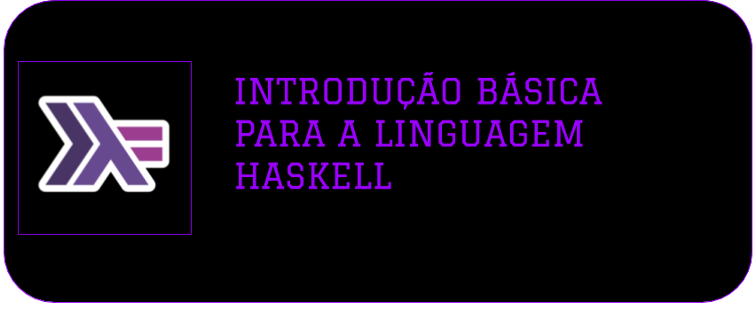

# Repositório de Informações sobre Haskell

---

---

**INFORMAÇÕES**

Página | Descrição
|---|---|
[Informações Básicas da Linguagem](infos/Basico_Da_Linguagem.md)| Algumas informações Básicas de Haskell
[Como compilar programas em Haskell](infos/Como_Compilar.md)| Todas as informações para compilar programs de Haskell
[Informações da Linguagem Haskell](infos/haskell.md)| Resumo sobre a Linguagem

**PROGRAMAS**

Programa | Descrição
|---|---|
[Fatorial com Recursão](programs/fatorial.hs)| Exemplo de Utilização de Recursão
[Escrevendo e Lendo Arquivos](programs/arquivos.hs) | Funções para Leitura de Arquivos
[Exemplo de uso de Lambdas](programs/lambda.hs)| Como Utilizar Lambdas nas Funções
[Funções Aleatórias](programs/functions.hs)| Algumas Funções de Teste

**VIDEO DE EXPLICAÇÃO**

