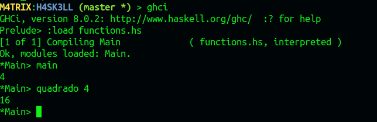

[Voltar](README.md)
|---|

# Como Compilar programas Haskell

### Utilizando o Linux

* Baixe o Compilador do Haskell:
    * `sudo apt-get install haskell-platform`


### Como compilar

**Passo 1**

* Crie um Arquivo com a extensão **hs** para ser lido como um arquivo haskell.
* Neste arquivo coloque as Funções que deseja implementar e no final crie uma função **main**.
* No **main** coloque o que deseja que seja a saida do seu programa como teste utilizando a função **print**,como um exemplo abaixo:

```hs
-- Função Desejada
quadrado:: Int -> Int
quadrado x = x * x

-- Saida de Teste
main = print (quadrado 2)
```

**Passo 2**

* No terminal, coloque o comando **ghci** no Diretório onde se encontra os seus arquivos de Haskell.
* Esse comando vai abrir o Compilador do Haskell chamado **GHCI**(**G**lasgow **H**askell **C**ompiler **I**nteractive) onde podemos interagir com os programas ou escrever testes mais Fácil.
* Aqui possui alguns comandos do GHCI:

Comando|Para que serve
|---|---|
**:quit** ou **:q**| Sair do Compilador
**:load nomeArquivo.hs** ou **:l nomeArquivo.hs**| Carrega um arquivo no compilador e inicia o arquivo
**:reload** ou **:r**| Reinicia a ultima chamada feita
**:cd nomeDiretorio**| Muda o Diretório para o Diretório Desejado

* Quando se inicia o compilador irá aparecer no canto esquerdo a mensagem **Prelude >**
* Quando se carrega o arquivo com o **:load** vai alterar essa mensagem para ***Main>**
* Se deseja carregar o exemplo base, coloque **main** 
* Se deseja fazer outro teste de outra função, chame o nome da função e o numero de teste: exemplo: **quadrado 4**

